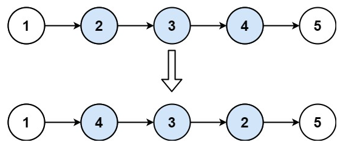

#### 92. Reverse Linked List II

Given the head of a singly linked list and two integers left and right where left <= right, reverse the nodes of the list from position left to position right, and return the reversed list.

 

**Example 1:**




```
Input: head = [1,2,3,4,5], left = 2, right = 4
Output: [1,4,3,2,5]
```

**Example 2:**

```
Input: head = [5], left = 1, right = 1
Output: [5]
```

 

**Constraints:**

- The number of nodes in the list is `n`.
- `1 <= n <= 500`
- `-500 <= Node.val <= 500`
- `1 <= left <= right <= n`


##### 思路

链表形式的数据结构，考虑从头开始反转、中间反转、起点与终点相同、起点与终点不同等几种情况，分别暂存前半部分未反转的、反转的第一个节点与末尾节点、后半部分未反转的。最后再链接起来。

考虑到对象引用的问题，最好是重新构建发生变化的node，而不是直接使用原node。


##### 实现

```javascript
/**
 * Definition for singly-linked list.
 * function ListNode(val, next) {
 *     this.val = (val===undefined ? 0 : val)
 *     this.next = (next===undefined ? null : next)
 * }
 */
/**
 * @param {ListNode} head
 * @param {number} left
 * @param {number} right
 * @return {ListNode}
 */
var reverseBetween = function(head, left, right) {
    let index = 1;
    let curNode = head;
    let headNode = new this.ListNode(head.val, head.next);
    let reverseHead = null;
    let preNode = null;
    let lastNode = null;
    if (index < left) {
        preNode = headNode;
    } else if (index >= left && index <= right) {
        reverseHead = new this.ListNode(head.val, head.next);
    }
    while (curNode.next) {
        index += 1;
        let nextNode = curNode.next;
        if (index < left) {
            let copyNextNode = new this.ListNode(nextNode.val, nextNode.next);
            preNode.next = copyNextNode;
            preNode = copyNextNode;
        } else if (index >= left && index <= right) {
            if (reverseHead) {
                if (!lastNode) {
                    lastNode = new this.ListNode(reverseHead.val, reverseHead.next);
                    lastNode.next = null;
                    let copyNextNode = new this.ListNode(nextNode.val, nextNode.next);
                    copyNextNode.next = lastNode;
                    reverseHead = copyNextNode;
                } else {
                    let copyNextNode = new this.ListNode(nextNode.val, nextNode.next);
                    copyNextNode.next = reverseHead;
                    reverseHead = copyNextNode;
                }
            } else {
                reverseHead = new this.ListNode(nextNode.val, nextNode.next);
            }
        } else if (index > right) {
            if (lastNode) {
                lastNode.next = nextNode;
                break;
            } else if (reverseHead) {
                reverseHead.next = nextNode;
                break;
            }
        }
        curNode = nextNode;
    }
    if (preNode && reverseHead) {
        preNode.next = reverseHead;
        return headNode;
    }
    if (reverseHead && !preNode) {
        return reverseHead;
    }
};
```

别人的解法

##### Code Two Pointers

```javascript
var reverseBetween = function(head, left, right) {
    if (!head || left === right) return head;
    
    const dummy = new ListNode(0);
    dummy.next = head;
    let prev = dummy;
    
    for (let i = 0; i < left - 1; ++i) {
        prev = prev.next;
    }
    
    let current = prev.next;
    
    for (let i = 0; i < right - left; ++i) {
        const nextNode = current.next;
        current.next = nextNode.next;
        nextNode.next = prev.next;
        prev.next = nextNode;
    }
    
    return dummy.next;
};
```

##### Code Recursion

```python
class Solution:
    def reverseBetween(self, head: Optional[ListNode], left: int, right: int) -> Optional[ListNode]:
        if not (head and left < right):
            return head

        def helper(node, m):
            nonlocal left, right
            if m == left:
                prev = None
                current = node
                while m <= right:
                    current.next, prev, current = prev, current, current.next
                    m += 1
                node.next = current
                return prev
            elif m < left:
                node.next = helper(node.next, m + 1)
            return node

        return helper(head, 1)
```

##### Code Stack

```python
class Solution:
    def reverseBetween(self, head: Optional[ListNode], left: int, right: int) -> Optional[ListNode]:
        if not head or left == right:
            return head

        dummy = ListNode(0)
        dummy.next = head
        prev = dummy

        for _ in range(left - 1):
            prev = prev.next

        stack = []
        current = prev.next

        for _ in range(right - left + 1):
            stack.append(current)
            current = current.next

        while stack:
            prev.next = stack.pop()
            prev = prev.next

        prev.next = current

        return dummy.next
```

